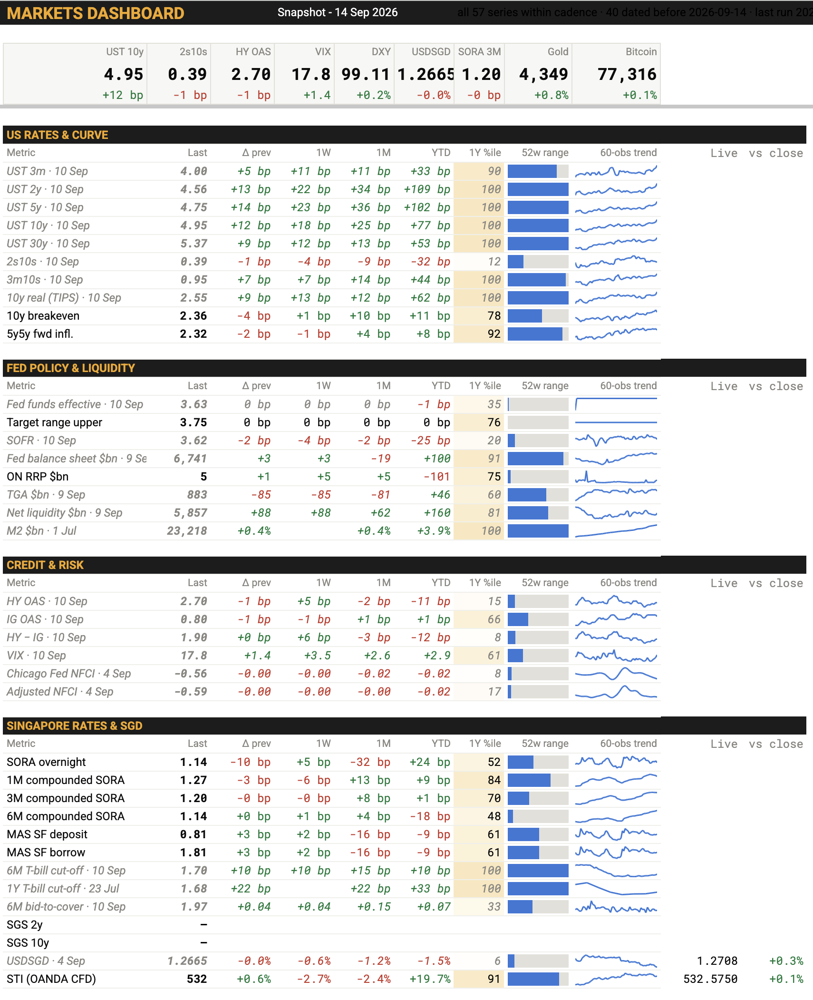
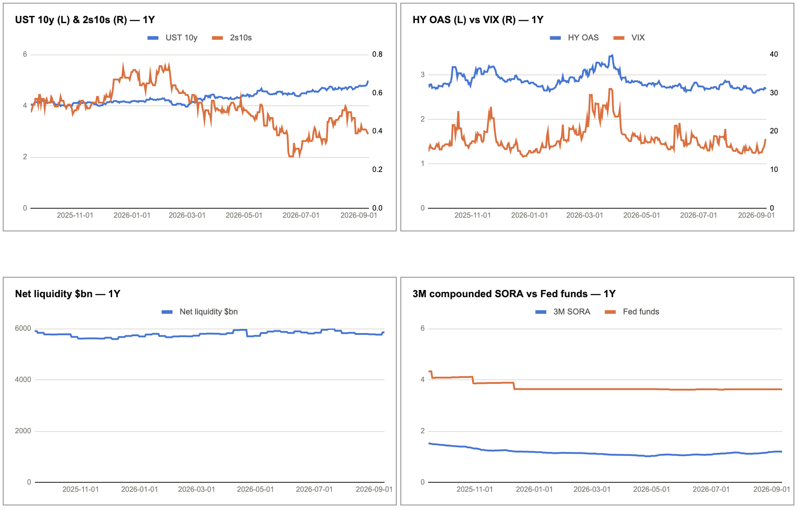
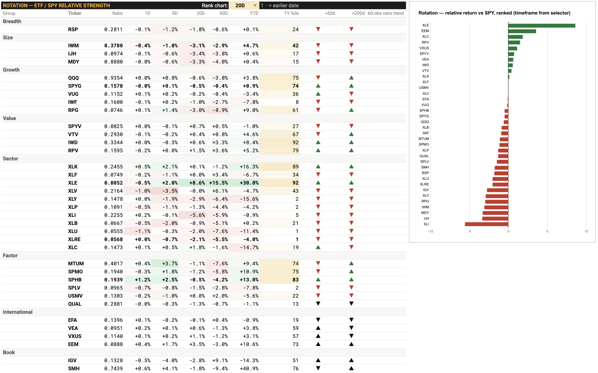

# Markets Dashboard

A daily macro and cross-asset monitor built in Google Sheets and Apps Script. 57 series across
US rates, Fed liquidity, credit, FX, commodities and the Singapore rates complex, pulled from
FRED, OANDA and MAS, with a 10-minute intraday quote layer over 35 instruments.

**[→ Live dashboard](https://docs.google.com/spreadsheets/d/e/2PACX-1vRylEVPn4EtaBEvDJ0yUfUljHOsDcZDUP5CmPcLytWtl5xr36oJ1VODV3stjziieIn_z7-yk8jfsSEu/pubhtml?gid=128131033&single=true)** — the Dashboard tab, republished automatically as the sheet refreshes.
[Static snapshot](https://docs.google.com/spreadsheets/d/1xaAF9PcQm51QEUD-6nGWGHNSrRzK3AVyA1PN_Rk4YY4/edit?usp=sharing) (14 Sep 2026) if the live page is unavailable.



---

## What it answers

The dashboard exists to replace a morning of tab-switching with one screen that says where risk
is being priced.

- **Is the risk backdrop shifting?** HY and IG OAS, the HY−IG gap, VIX and the Chicago Fed NFCI
  sit on one panel with 1-day, 1-week, 1-month and YTD deltas and a 1-year percentile, so a
  spread widening registers as a percentile move rather than a number with no reference.
- **Is liquidity draining?** Fed net liquidity is computed as balance sheet − Treasury General
  Account − ON RRP, the three components alongside it. That combination is not published as a
  series anywhere; it has to be assembled.
- **What is the curve doing?** 3m through 30y, 2s10s and 3m10s, plus the 10y TIPS real yield,
  10y breakeven and 5y5y forward inflation — so a yield move separates into real rates and
  inflation compensation.



- **Where is leadership?** A relative-strength screen ranks 37 sector, style, factor and regional
  ETFs against SPY over 1D / 5D / 20D / 60D / YTD, with 50- and 200-day ratio trend flags.
- **What is Singapore doing?** Compounded SORA at overnight, 1M, 3M and 6M, the MAS standing
  facility corridor, and T-bill cut-off yields with bid-to-cover — the local complex that an
  off-the-shelf screen doesn't carry.



## Architecture

```
FRED  ──┐
OANDA ──┼──► fetch (windowed, checkpointed) ──► MacroHistory ──► rolling 1/2/5/10Y mirrors
MAS   ──┘                                                              │
                                                                       ▼
GOOGLEFINANCE ──► Ratios (ETF/SPY, 2015→) ──► RatiosLatest ──► Dashboard  ◄── Live (10-min)
```

| Layer | File | What it does |
|---|---|---|
| Ingest | `apps-script/code.gs` | Series registry, per-source fetchers, windowed upsert into a single daily history, rolling mirrors, health checks |
| Presentation | `apps-script/dashboard.gs` | Panel layout, statistics (deltas, percentiles, 52-week range, sparkline trends), conditional formatting, charts |
| Intraday | `apps-script/live.gs` | 35 OANDA instruments every 10 minutes, each compared against its own previous completed daily candle |

`data/series-registry.csv` is the config that drives ingest — one row per series, mapping a
`series_id` to its source, source identifier and field. Adding a series is a row, not a code change.

## Methodology notes

**DXY is computed, not downloaded.** No free daily source publishes it, so it is rebuilt from the
six ICE basket components (EUR, JPY, GBP, CAD, SEK, CHF) at the published weights, with history
back to 1971. The intraday layer uses the same weights on live mids, so the live number and the
settled number are the same index rather than two approximations of it.

**The rotation panel is cut to a common as-of date.** `GOOGLEFINANCE` fills its trailing rows at
different times, so on any given morning some tickers have yesterday's close and some don't.
Ranking across that mix compares a 20-day return ending Monday against one ending Friday. The
panel date is set to the last date at least 60% of tickers share; laggards are computed at their
own date and flagged rather than silently mixed in.

**The intraday reference is like-for-like.** An earlier version compared a live mid against
whatever the daily history held, which for Brent meant measuring a live quote against a close
nine days old and reporting it as a day move. The reference is now OANDA's own previous completed
daily candle for the same instrument on the same 17:00 NY alignment.

**Live quotes never enter the history.** A live mid is an intraday observation of a day that has
not closed; writing it into a one-row-per-day history would corrupt every moving average and
every previous-close comparison downstream.

## Engineering notes

Apps Script caps a single execution at six minutes, which is less than 57 series of fetching plus
a full presentation rebuild. The pipeline is therefore built to be interrupted:

- **Checkpointed fetches.** A run that approaches the cap writes a cursor and returns. Every
  cursor is stamped `yyyy-MM-dd|SERIES_ID`; a cursor that isn't from today is discarded rather
  than obeyed, which is what stops a stale bookmark from silently skipping series the next morning.
- **Self-scheduling continuation.** Each pause schedules a one-off trigger two minutes out, so a
  run drives itself to completion instead of waiting for a clock that may not come. Capped per day.
- **Two clocks.** `LAST_RUN` advances on any execution that did work; `LAST_COMPLETE` only when
  every finalize stage finished. The header prints the second, so the sheet cannot show a fresh
  timestamp over stale data.
- **Single-writer locking.** Continuations can overlap a scheduled run; a sheet-level lock
  serialises them.
- **Windowed fetching.** Each run re-reads a trailing window sized from the newest row present,
  so an outage heals itself and FRED revisions to already-printed numbers land instead of being
  permanently missed by a forward-only fetch.
- **Per-series staleness checks.** `healthCheck()` tests each series against the publish lag and
  cadence of its own release — a weekly claims print and a monthly PCE print are not late on the
  same schedule — so a series that stops updating is flagged rather than quietly frozen.

The header comments in `code.gs` and `live.gs` are kept as a running changelog of failures and
their causes, which is most of the story of how the thing got reliable.

## Setup

Requires a FRED API key, an OANDA practice or live API key, and (for the Singapore series) a MAS
API gateway key. All three are read from Apps Script Script Properties, never from the sheet.

```
1. Create a Sheet, Extensions → Apps Script, paste the three .gs files
2. Script Properties: FRED_API_KEY, OANDA_API_KEY, MAS_API_KEY
3. Run setupSheets(), then paste series-registry.csv into the Series tab
4. Run firstRun()  — setup, backfill, install triggers
5. Run installLiveTriggers() for the intraday layer
```

`probeOanda()`, `probeMasGw()` and `probeGoogleFinance()` verify each source independently before
a full run.

## Licence

MIT. The published page exposes the Dashboard tab only; the underlying workbook, its
configuration and its account tabs are not reachable from it.
